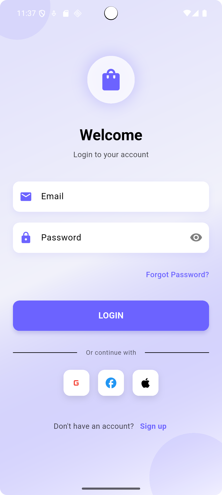
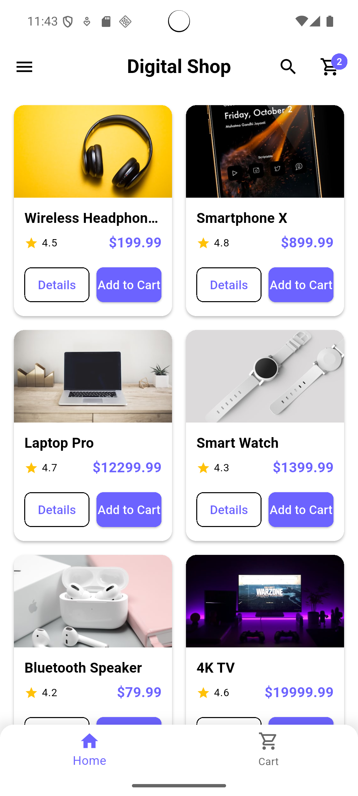
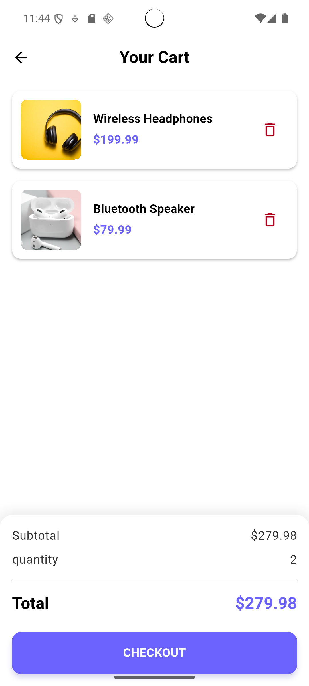
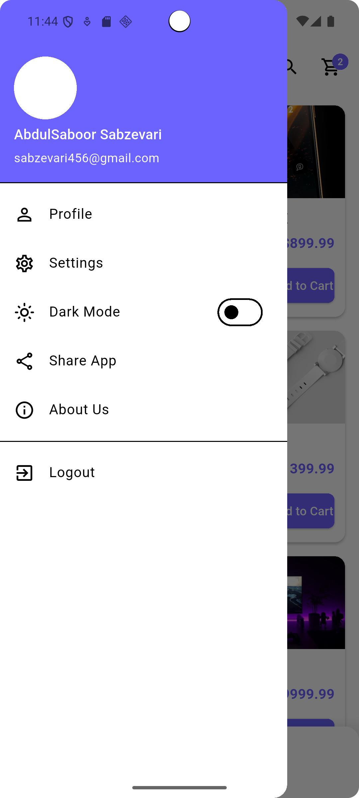
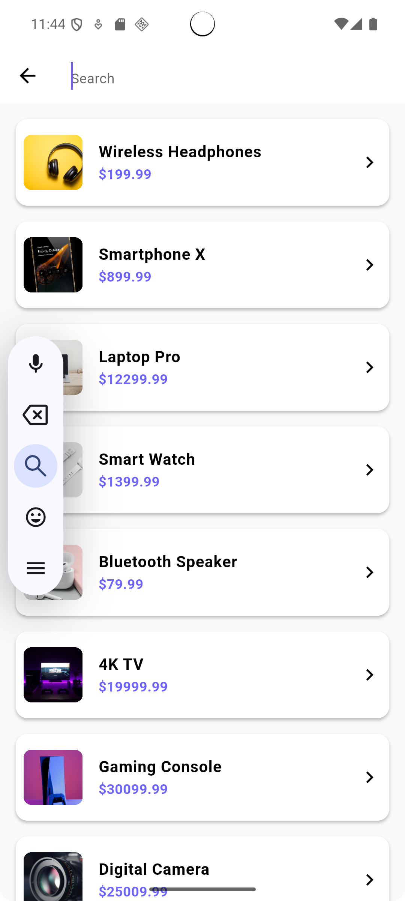

# 🛍️ Digital Shop

**Digital Shop** یک اپلیکیشن فروشگاهی موبایل ساخته شده با **Flutter** است که تجربه‌ای روان و زیبا برای خرید آنلاین فراهم می‌کند. این پروژه شامل طراحی واکنش‌گرا، قابلیت سوییچ بین تم روشن و تاریک، و امکانات کامل برای ثبت سفارش می‌باشد.

## ✨ ویژگی‌ها

- 🎨 پشتیبانی از تم روشن و تاریک
- 📱 رابط کاربری زیبا و واکنش‌گرا
- 🛒 سبد خرید با امکان ویرایش اقلام
- 👤 صفحه لاگین با اعتبار سنجی
- 📂 بدون نیاز به پکیج‌های مدیریت وضعیت (state management)

## 📸 اسکرین‌شات‌ها









## ⚙️ نصب و اجرا

برای اجرای پروژه روی دستگاه خود:

```bash
git clone git@github.com:SaboorSabzevari/Digital-shop.git
cd Digital-shop
flutter pub get
flutter run
